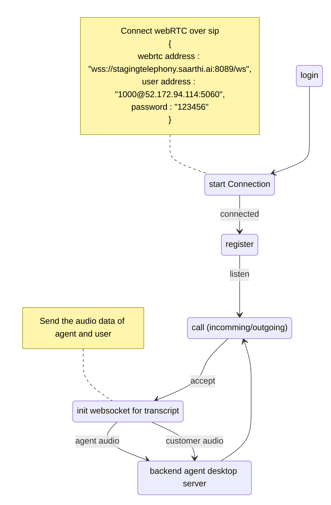

-[front end](#front-end)

## todo

- [ ] on incomming call implimentation
- [ ] to test with real phone

# technologies required

- sip (Session Initiation Protocol)
- webRtc (Real time communication)
-

# front end

- jssip
  - <https://jssip.net/documentation/3.3.x/api/ua_configuration_parameters/>

# Main Architecture

